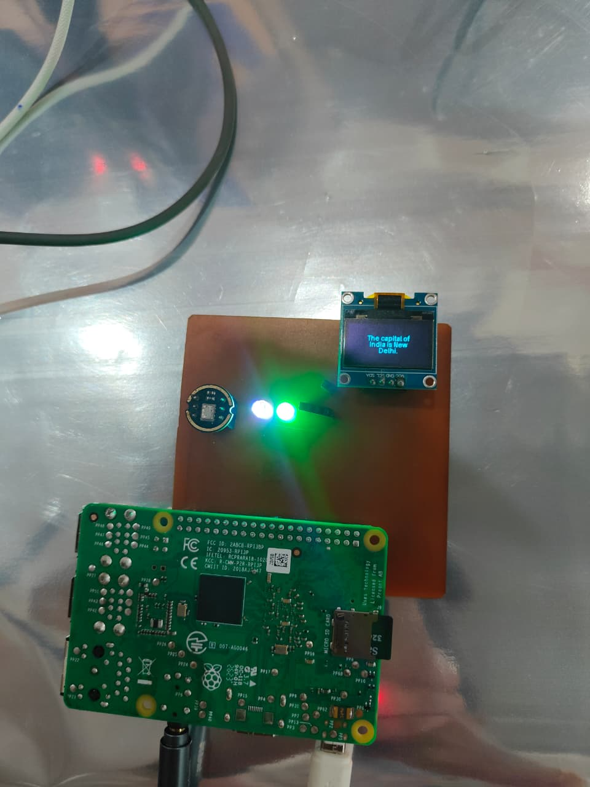
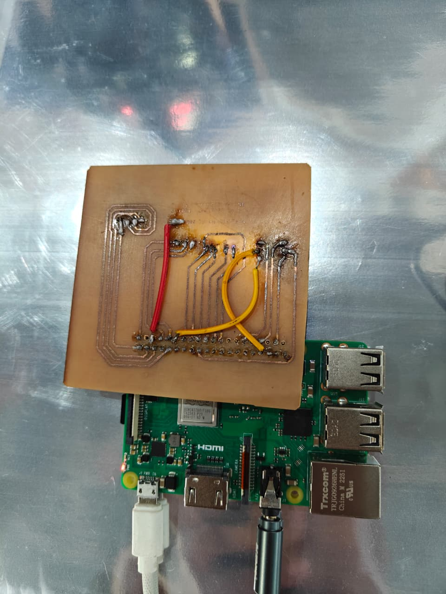

# Blueberry Voice Assistant

> A wake-word activated, AI-powered voice assistant built on Raspberry Pi — with a live animated OLED face, natural language understanding via Google Gemini, offline speech recognition, and extensible UART-based hardware control.

**Developed by [Vishwas Paliwal](https://github.com/vviszard)**  
ECE Undergraduate — Sagar Institute of Science and Technology (SISTec), Bhopal  
IoT Centre of Excellence, SISTec

---

## Table of Contents

- [Overview](#overview)
- [Features](#features)
- [System Architecture](#system-architecture)
- [Hardware](#hardware)
- [Software & Dependencies](#software--dependencies)
- [Project Structure](#project-structure)
- [Setup & Installation](#setup--installation)
- [API Keys](#api-keys)
- [Configuration](#configuration)
- [Usage](#usage)
- [Running as a Service (Auto-start on Boot)](#running-as-a-service-auto-start-on-boot)
- [Extensibility](#extensibility)
- [PCB Design](#pcb-design)
- [Demo](#demo)
- [Contributors](#contributors)
- [License](#license)

---

## Overview

**Blueberry** is a locally-hosted, always-on voice assistant — similar in concept to Amazon Alexa or Google Home — but fully open, customizable, and running on a Raspberry Pi 3B+. It listens passively for its wake word *"Blueberry"*, captures your command via offline STT (Vosk), sends it to Google Gemini for AI-powered responses, and speaks back using gTTS with an Indian-English voice.

The assistant also features a real-time animated OLED face that reacts to its current state — idle blinking eyes, focused listening, and scrolling response text — making it feel genuinely alive.

---

## Features

- **Wake Word Detection** — Always-on passive listening via Picovoice Porcupine (`"blueberry"`)
- **AI Responses** — Powered by Google Gemini 2.5 Flash Lite
- **Offline STT** — Speech-to-text via Vosk (Indian English model, no cloud required)
- **Natural TTS** — Google Text-to-Speech (`gTTS`) with Indian English accent; Festival TTS as offline fallback
- **Animated OLED Face** — SSD1306 display with physics-based blinking pupils and state-driven expressions
- **RGB Status LED** — Visual feedback for each assistant state (idle, listening, processing, speaking)
- **UART Hardware Bridge** — Send commands to external microcontrollers (ESP32) over serial for physical actuation
- **Keyword-based Command Routing** — Detects action keywords and routes them directly to hardware, bypassing the AI

---

## System Architecture

```
                        ┌─────────────────────────────────────┐
                        │         Raspberry Pi 3B+            │
                        │                                     │
  INMP441 Mic ────────► │  Porcupine (Wake Word)              │
                        │       │                             │
                        │       ▼                             │
                        │  Vosk STT (Offline)                 │
                        │       │                             │
                        │       ├──── Keyword Match? ──► UART ──► ESP32 / Hardware
                        │       │                             │
                        │       └──► Gemini 2.5 Flash Lite   │
                        │                 │                   │
                        │                 ▼                   │
                        │           gTTS / Festival           │
                        │                 │                   │
  Speaker (3.5mm) ◄─── │           Audio Playback            │
                        │                                     │
  SSD1306 OLED ◄─────── │  RobotFace Thread (Animated)       │
  RGB LED ◄──────────── │  State Machine (IDLE/LISTEN/etc.)  │
                        └─────────────────────────────────────┘
```

---

## Hardware

| Component | Details |
|---|---|
| **Main Board** | Raspberry Pi 3B+ |
| **Microphone** | INMP441 Digital MEMS Microphone (I2S) |
| **Display** | SSD1306 0.96" OLED (I2C, address `0x3C`) |
| **RGB LED** | Common-anode RGB LED (GPIO 8, 23, 24) |
| **Status LED** | Standard white LED (GPIO 25) |
| **Speaker** | Passive speaker via 3.5mm audio jack |
| **Custom PCB** | Hand-etched PCB integrating all components (Gerber files included) |
| **External Controller** | ESP32 via UART (`/dev/serial0`, 115200 baud) — optional |

### GPIO Pinout

| GPIO | Function |
|---|---|
| 25 | White status LED |
| 8 | RGB LED — Red |
| 23 | RGB LED — Green |
| 24 | RGB LED — Blue |
| SDA / SCL | OLED SSD1306 (I2C bus 1) |
| TX / RX | ESP32 UART serial bridge |

---

## Software & Dependencies

**Python 3.9+** is required. Install all dependencies with:

```bash
pip install pvporcupine pvrecorder vosk sounddevice google-genai gtts luma.oled gpiozero pyserial python-dotenv
```

| Package | Purpose |
|---|---|
| `pvporcupine` | Wake word detection |
| `pvrecorder` | Microphone capture for Porcupine |
| `vosk` | Offline speech-to-text |
| `sounddevice` | Audio stream for Vosk |
| `google-genai` | Google Gemini API client |
| `gTTS` | Text-to-speech (cloud) |
| `luma.oled` | SSD1306 OLED driver |
| `gpiozero` | GPIO control (LEDs) |
| `pyserial` | UART communication with ESP32 |
| `python-dotenv` | Environment variable management |

**System packages:**
```bash
sudo apt update && sudo apt install mpg123 festival
```

---

## Project Structure

```
blueberry-voice-assistant/
│
├── pico_gyan_led.py       # Main application — wake word, STT, AI, TTS, hardware control
├── face.py                # Animated OLED face thread — state-driven eye animations
│
├── pcb/
│   └── gerber/            # Gerber files for the custom PCB
│
├── demo/
│   ├── images/            # Project photos
│   └── videos/            # Demo recordings
│
└── .env                   # API keys — NOT committed (see API Keys section)
```

---

## Setup & Installation

### 1. Clone the repository

```bash
git clone https://github.com/vviszard/blueberry-voice-assistant.git
cd blueberry-voice-assistant
```

### 2. Install dependencies

```bash
pip install pvporcupine pvrecorder vosk sounddevice google-genai gtts luma.oled gpiozero pyserial python-dotenv
sudo apt install mpg123 festival
```

### 3. Download the Vosk model

Download the Indian English model from [alphacephei.com/vosk/models](https://alphacephei.com/vosk/models):

```bash
wget https://alphacephei.com/vosk/models/vosk-model-small-en-in-0.4.zip
unzip vosk-model-small-en-in-0.4.zip
```

Update the model path in `pico_gyan_led.py` if your path differs:
```python
v_model = Model("/path/to/vosk-model-small-en-in-0.4")
```

### 4. Enable I2C on Raspberry Pi

```bash
sudo raspi-config
# Navigate to: Interface Options → I2C → Enable
```

### 5. Create your `.env` file

```
GENAI_API_KEY=your_google_gemini_api_key_here
PICOVOICE_KEY=your_picovoice_access_key_here
```

> ⚠️ **Never commit your `.env` file.** See the [API Keys](#api-keys) section and ensure `.env` is in your `.gitignore` before your first commit.

A minimal `.gitignore` for this project:
```
.env
*.mp3
response.mp3
tts_backup.txt
__pycache__/
*.pyc
```

---

## API Keys

Blueberry requires two external API keys. Both offer a **free tier** sufficient for personal use.

### Google Gemini API
- Sign up at [aistudio.google.com](https://aistudio.google.com)
- Generate an API key and set it as `GENAI_API_KEY` in your `.env`
- Free tier available with generous rate limits

### Picovoice Porcupine (Wake Word Engine)
- Sign up at [console.picovoice.ai](https://console.picovoice.ai)
- Copy your `AccessKey` and set it as `PICOVOICE_KEY` in your `.env`
- Free tier supports all built-in wake words, including `"blueberry"`

---

## Configuration

Key constants at the top of `pico_gyan_led.py`:

| Variable | Default | Description |
|---|---|---|
| `MIC_DEVICE_INDEX` | `2` | Sounddevice index for your microphone |
| `WAKE_WORD` | `'blueberry'` | Porcupine built-in wake word |
| `MOVEMENT_KEYWORDS` | see code | Maps spoken phrases to ESP32 UART commands |

To find your microphone's device index:
```python
import sounddevice as sd
print(sd.query_devices())
```

---

## Usage

```bash
python pico_gyan_led.py
```

Once running:

1. The OLED displays a boot splash, then enters idle mode with animated blinking eyes
2. Say **"Blueberry"** — the assistant beeps and eyes shift to focused listening mode
3. Speak your command or question naturally
4. Blueberry processes it, displays and speaks the response, then returns to idle

**LED status at a glance:**

| LED Color | State |
|---|---|
| White ON | Idle — waiting for wake word |
| Blue | Listening — recording your command |
| Green | Speaking — playing audio response |
| Red | Error — check serial/network connection |

---

## Running as a Service (Auto-start on Boot)

Blueberry is designed to run as a `systemd` service so it starts automatically every time the Raspberry Pi powers on — no terminal, no manual intervention, just plug in and it's live.

### 1. Create the service file

```bash
sudo nano /etc/systemd/system/gyan_bot.service
```

### 2. Paste this configuration

```ini
[Unit]
Description=Gyan Bot Voice Assistant
After=network.target sound.target pulseaudio.service

[Service]
Type=simple
User=iot-coe-2025
Group=iot-coe-2025
WorkingDirectory=/home/iot-coe-2025
ExecStart=/home/iot-coe-2025/my_voice/bin/python /home/iot-coe-2025/final_bot/pico_gyan_led.py
Restart=always
RestartSec=5

# Required fix for PulseAudio permission errors:
Environment="XDG_RUNTIME_DIR=/run/user/1000"
Environment="PULSE_RUNTIME_PATH=/run/user/1000/pulse"

[Install]
WantedBy=multi-user.target
```

> **Note:** Update `User`, `Group`, `WorkingDirectory`, and `ExecStart` paths to match your own username and virtual environment if they differ from the ones above.

The two `Environment` lines are a required fix — without them, the service crashes on boot because it cannot access the PulseAudio socket before the user session is fully initialized.

### 3. Enable and start the service

```bash
sudo systemctl daemon-reload
sudo systemctl enable gyan_bot.service
sudo systemctl start gyan_bot.service
```

### Useful commands

| Command | Purpose |
|---|---|
| `sudo systemctl status gyan_bot.service` | Check if the service is running |
| `sudo systemctl stop gyan_bot.service` | Stop the assistant |
| `sudo systemctl disable gyan_bot.service` | Disable auto-start (useful during development) |
| `journalctl -u gyan_bot.service -f` | Live logs for debugging |

---

## Extensibility

The UART-based command bridge makes Blueberry straightforward to extend beyond a standalone assistant. Any microcontroller that accepts serial commands can be integrated. As a demonstration of this, the assistant is connected to an ESP32-controlled servo robot — spoken commands like *"dance"*, *"walk"*, or *"salute"* are intercepted before reaching the AI and routed directly to the robot over UART.

Adding a new hardware action is as simple as extending the `MOVEMENT_KEYWORDS` dictionary:

```python
MOVEMENT_KEYWORDS = {
    "your_keyword": "uart_command_string",
    # add as many as needed
}
```

The same pattern can drive smart lights, relays, displays, or any serial-capable peripheral — making Blueberry a general-purpose voice-to-hardware bridge.

---

## PCB Design

The custom PCB is a single-layer, hand-etched Raspberry Pi HAT-style shield that integrates the RGB LED, white status LED, and breakout headers for the OLED, microphone, and ESP32 into one compact board — eliminating breadboard wiring entirely. It seats directly on the Pi 3B+ via a 40-pin female header.

Designed in KiCad by **Nikhil Misal**. Gerber files and full design notes are in [`pcb/`](pcb/README.md).

---

## Demo

### System



### PCB Shield (Back View)



### Video Demo

[](https://youtu.be/ck8D_fbSyfE?si=1WoNeZFP7AxhFfde)

---

## Contributors

| Name | Role |
|---|---|
| [Vishwas Paliwal](https://github.com/vviszard) | Project lead — software, system design, integration |
| [Nikhil Misal](https://github.com/Nikhil-Misal-24) | Hardware — PCB design (KiCad) and hand-etching |

---

## License

© 2025 Vishwas Paliwal. All Rights Reserved.

This project is shared for educational and portfolio purposes. You may not copy, distribute, or use this code or hardware designs in your own projects without explicit written permission from the author.

---

*Built with curiosity at the IoT Centre of Excellence, SISTec, Bhopal.*
